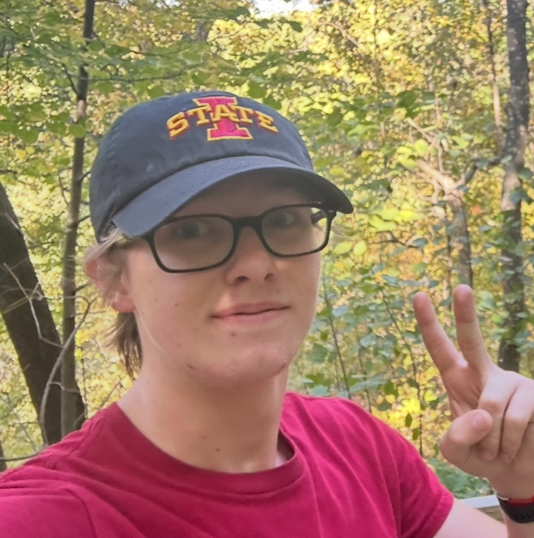
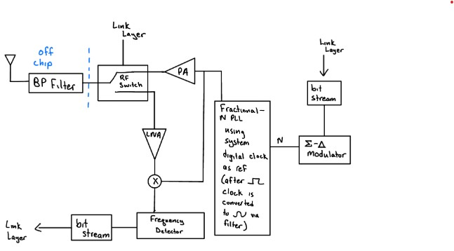
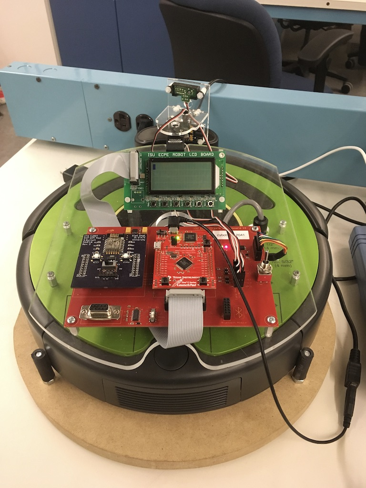
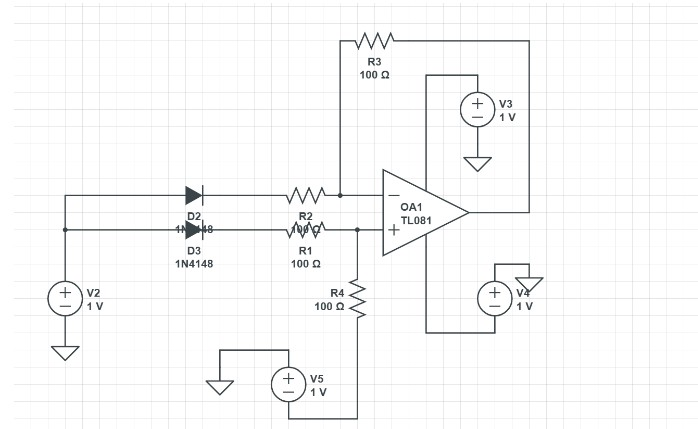
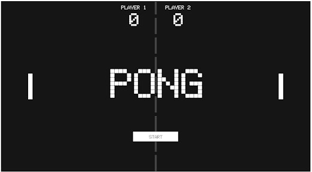

# Jackson Doyle 
Email: jbdoyle1@iastate.edu

Welcome to my portfolio page! My name is Jackson Doyle and I am a senior in Electrical Engineering at Iowa State. I will graduate class Fall 2026

Career Objective: I would like to work in a position regarding power systems design or power generation and contribute to improving the efficiency of our grid and help move towards a cleaner energy future.

# Projects

## Senior design Project
Project description: Open source radio microcontroller for fabrication

My role: Phy layer/analog work

Skills learned: Analog VLSI, time management. This project was heavy in analog design work. The overall architecture was to transmit a bluetooth signal from antenna to ADC.

Link to documents: [Senior Design page](https://sddec26-10.sd.ece.iastate.edu/#teammembers)

Big picture contibutions: Contributed towards project completion by utilizing skills learned in VLSI and analog ASIC design. Helped with planning and design work as well.

## project 1: CPRE2880: Gardening Cybots

Project description: program cybots to "do maintenance" on plants and clean surreounding areas, removing debris such as leaves and bugs. In the case of this project, the debris was a tinfoil wrapping around objects. Scanners were used to identify objects with foil wrapping and thus indicate that they were plants that required maintenance.

My role: Helped in the developement of the gui and creation of documentation. Front end project development and technical reporting were my primary responsibilities alongside some component soldering and circuit implementation

Skills learned: Python, Circuitry, and Planning

Resources used: Git and VS code

## project 2: EE 3300: Diode Based Temperature Sensor

Project description: Develop a linear temperature sensor using diodes and a difference amplifier. 
Proving its funcitonality within the Cadence software in the CMOS process

My role: Developed the circuit architecture and defining characteristic equations. Modeled the circuit in Cadence and reached a working model. The final architecture utilized a difference amplifier to create a linear slope of voltage output over a temperature sweep. The op-amp was externally compensated and values were determined through calculation to meet the projects criteria.

Skills learned: Cadence, circuit design, software implementation and layout of CMOS process

Resources used: Cadence

## project 3: EE 2850: Arduino Pong Game

Project description: Develop a fully playable pong game on an LCD screen using potentiometer controllers and using an Arduino uno for back end development 

My role: Developed the circuit design that was used to power the LCD and connect to the various arduino ports available. Additionally I assisted with the programming of the arduino itself using the arduino software.

Skills learned: Arduino, coding, circuit design, circuit analysis and connecting hardware and software

Resources used: Arduino, Arduino Uno

[Jackson Doyle Resume](images/FinalUpdatedResume%20(2).pdf)

[General Education Reflection]()

[Cumulative Reflection](images/Jackson%20Doyle.pdf)

[Ethics paper from CPRE/EE 2320](images/CaseStudy2320.pdf)